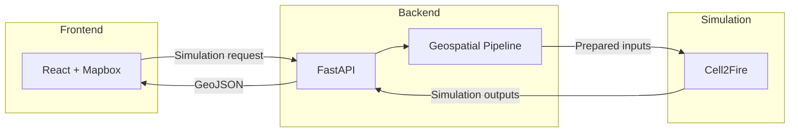

# fuego-gis-pipeline

**My Tran** — Geospatial Engineer  
Portfolio repository documenting my contribution to the geospatial preprocessing layer of **Fuego**, a cloud-native wildfire simulation platform.

---

## 1. Project Overview

Fuego is a cloud-native wildfire simulation platform that allows users to evaluate how wildfire spread changes under different ignition locations and weather conditions. The system combines publicly available geospatial datasets from USGS LANDFIRE with the Cell2Fire simulation engine and presents results through an interactive React + Mapbox interface. Users click a location on the map, choose a fire date and weather window, and watch a time-stepped burn animation — without ever needing to understand raster formats, coordinate reference systems, or simulation file conventions.

This repository is **not** the full Fuego application. It isolates the geospatial preprocessing subsystem I built and maintained: the layer that turns raw federal landscape data into the exact file-based inputs Cell2Fire expects, and that later converts simulation grids into lightweight GeoJSON for the frontend.

---

## 2. The Overall System




| Component                                   | Responsibility                                                          |
| ------------------------------------------- | ----------------------------------------------------------------------- |
| **React + Mapbox**                          | User interaction, map rendering, and 60fps burn-perimeter animation     |
| **FastAPI**                                 | Request orchestration, caching, authentication, and simulation dispatch |
| **Geospatial pipeline** *(this repository)* | Data acquisition, raster preprocessing, and simulation input synthesis  |
| **Cell2Fire**                               | Physics-based fire spread simulation on a cell grid                     |
| **GeoJSON vectorization**                   | Converts binary burn grids into frontend-ready geometries               |


The backend sits in the middle on purpose. It never exposes raster processing to HTTP clients directly — it calls the pipeline as an internal service, runs Cell2Fire as a subprocess, and only returns structured JSON to the browser. That separation was a deliberate architectural choice I worked within: my scope was making the pipeline reliable and predictable so the rest of the team could treat it like a black box.

---

## 3. Where My Work Fits

This repository focuses on the **geospatial preprocessing subsystem** that prepares simulation-ready inputs for Cell2Fire and post-processes simulation output for visualization.

```
LANDFIRE (public federal API)
        │
        ▼
   Download & validate multi-band GeoTIFF
        │
        ▼
   Raster preprocessing (split, align, convert)
        │
        ▼
   Generate Cell2Fire inputs (Weather.csv, Ignitions.csv, .asc grids)
        │
        ▼
   FastAPI backend (orchestration — outside this repo)
        │
        ▼
   Cell2Fire simulation
        │
        ▼
   Vectorize burn grids → GeoJSON (frontend boundary)
```

This repository documents the geospatial processing subsystem that I developed for Fuego. It covers automated LANDFIRE acquisition, raster harmonization, simulation input generation, and the interfaces that connect these outputs to the backend simulation service and frontend visualization. Other parts of the system—including the FastAPI application, React interface, and Cell2Fire simulation engine—are described only to provide architectural context.

Understanding those boundaries — and designing clean interfaces between them — was a core part of my learning on this project.

---

## Quick Start

```bash
python -m venv .venv
source .venv/bin/activate
pip install -r requirements.txt
cp .env.example .env   # add your LANDFIRE_EMAIL
```

```python
from src.pipeline import GisPipeline
from src.schemas import WeatherPoint

pipeline = GisPipeline()

weather_profile = [
    {
        "lat": 38.25,
        "lon": -120.25,
        "timestamp": "2021-08-18T14:00Z",
        "temp": 32.0,
        "rh": 18.0,
        "ws": 22.0,
        "wd": 245.0,
        "precip": 0.0,
        "pressure": None,
    },
    {
        "lat": 38.25,
        "lon": -120.25,
        "timestamp": "2021-08-18T15:00Z",
        "temp": 33.0,
        "rh": 16.0,
        "ws": 24.0,
        "wd": 250.0,
        "precip": 0.0,
        "pressure": None,
    },
]

result = pipeline.prepare_simulation_inputs(
    location=(38.25, -120.25),
    radius_km=3.0,
    weather_profile=weather_profile,
)

print(result["weather_csv"])
print(result["ignitions_csv"])
```

---

## Repository Layout


| Module              | Stage           | Responsibility                                       |
| ------------------- | --------------- | ---------------------------------------------------- |
| `src/extractor.py`  | 1               | USGS LANDFIRE automated ETL                          |
| `src/harmonizer.py` | 2               | Raster grid transformation and ASC export            |
| `src/generator.py`  | 3               | Weather.csv and Ignitions.csv synthesis              |
| `src/vectorizer.py` | Post-simulation | GeoJSON time-series optimization for Mapbox          |
| `src/pipeline.py`   | Integration     | Unified facade consumed by the FastAPI service layer |


---

## 4. Geospatial Pipeline

Cell2Fire does not read GeoTIFFs, WMS layers, or REST API responses. It reads a specific set of flat files — ESRI ASCII grids for terrain and fuel, plus two CSV files for weather and ignition coordinates. The entire pipeline exists to bridge that gap: from *what the world publishes* to *what the simulator consumes*.

The pipeline is divided into three stages. Each stage has a single responsibility and produces artifacts the next stage (or the backend) can depend on without knowing how the previous stage worked.

---

### Stage 1: Dataset Acquisition

**Why LANDFIRE?**

Cell2Fire needs fuel models, elevation, slope, and aspect at consistent 30-meter resolution across the simulation domain. LANDFIRE is the authoritative federal product for CONUS wildland fuel and terrain — it bundles the layers we need into a single multi-band download rather than forcing us to stitch together separate DEM, land cover, and fuel sources. Choosing LANDFIRE was a data-availability decision first; the engineering challenge was automating access to a system that was never designed for real-time web applications.

**The extraction workflow**

LANDFIRE's Processing Service is asynchronous. You cannot simply `GET` a file — you submit a job, wait in a federal queue, and poll until a ZIP bundle is ready. The extraction stage automates that entire lifecycle:

```
User AOI (lat, lon, radius)
        │
        ▼
Compute WGS84 bounding box
        │
        ▼
Submit job to LANDFIRE API
        │
        ▼
Poll status every 15s (up to 600s timeout)
        │
        ▼
Download ZIP → extract multi-band GeoTIFF
        │
        ▼
Validate bands, CRS, and pixel coverage
```

**What I had to handle in practice**

Federal servers are slow and occasionally drop connections. The polling loop tolerates transient HTTP failures without aborting the job, distinguishes `Succeeded` / `Failed` / `Canceled` states explicitly, and surfaces timeout errors with the last known status so debugging a stuck job does not require re-running a 10-minute download. After extraction, validation checks that the expected number of bands are present and that the raster is not entirely nodata — catching empty AOI responses before they propagate into a simulation that would silently produce no fire spread.

Metadata (bounds, resolution, EPSG code) is captured at extraction time so downstream stages never need to re-open the raw federal bundle to discover spatial extent.

---

### Stage 2: Raster Harmonization

**The problem**

LANDFIRE delivers all requested layers stacked in a single multi-band GeoTIFF. Cell2Fire expects each layer as a separate file in ESRI ASCII format with integer cell values and a specific header layout. Between those two formats sits a chain of spatial operations: band splitting, CRS confirmation, grid alignment, and format conversion.

```
Multi-band GeoTIFF (federal download)
        │
        ▼
Extract individual layers (fuels, elevation, slope, aspect, canopy)
        │
        ▼
Confirm / align CRS and 30 m cell grid (EPSG:5070 for CONUS)
        │
        ▼
Reproject ancillary layers onto reference fuel grid (when needed)
        │
        ▼
Export ESRI ASCII (.asc) — Forest.asc, elevation.asc, slope.asc, saz.asc
        │
        ▼
Simulation-ready instance directory
```

**CRS and resolution**

Simulation accuracy depends on working in a projected, metric coordinate system — not WGS84 degrees. For CONUS deployments, LANDFIRE is requested in EPSG:5070 (NAD83 Albers), which gives equal-area properties suited to landscape-scale fire modeling. When supplemental layers arrive in a different CRS, the harmonization stage reprojects them onto the fuel grid's exact transform and dimensions using bilinear resampling for continuous surfaces (elevation, slope) and nearest-neighbor for categorical data (fuel codes).

**Why ESRI ASCII?**

Cell2Fire's C++ engine predates modern GeoTIFF-first workflows. It reads plain-text grid files with integer-only headers (`ncols`, `nrows`, `xllcorner`, `cellsize`) and parses cell values with `std::stoi()`. Exporting ASCII is not an aesthetic choice — it is a hard compatibility requirement. The harmonization stage writes single-space-separated integer rows and validates header formatting because a single decimal point in `cellsize` will crash the simulator at runtime.

---

### Stage 3: Simulation Input Generation

Once terrain layers exist, the pipeline must synthesize the two CSV inputs that drive fire behavior: **weather** (how fast and in what direction the fire spreads each timestep) and **ignition** (where the fire starts on the cell grid).

#### Weather.csv

Cell2Fire advances weather every 5 minutes across a multi-hour simulation window. Weather APIs return hourly observations. The generation stage:

1. Accepts hourly weather anchors (temperature, relative humidity, wind speed, wind direction, precipitation).
2. Linearly interpolates between anchors at 5-minute intervals, using shortest-arc interpolation for wind direction to handle compass wraparound (e.g., 350° → 10°).
3. Chains Van Wagner (1977) Fine Fuel Moisture Code (FFMC) across timesteps so each row's moisture state depends on the previous row — not a static lookup.
4. Writes the exact column schema Cell2Fire expects: `TMP`, `RH`, `WS`, `WD`, `FFMC`, plus fixed moderate-danger values for daily FWI indices (DMC, DC, ISI, BUI, FWI) that cannot be computed accurately from a 6-hour weather window alone.

This was one of the more research-intensive parts of the project. Getting FFMC wrong does not crash the simulator — it silently changes spread rate. Understanding the Van Wagner equations and validating output ranges against published fire weather references was how I confirmed the physics inputs were credible.

#### Ignitions.csv

Users click a lat/lon on the map. Cell2Fire expects a 1-indexed cell number in row-major order. The generation stage:

1. Reprojects the WGS84 click coordinate into the fuel grid's CRS.
2. Resolves the nearest raster cell.
3. Checks the cell against the FBFM40 fuel lookup table — if the clicked pixel is water, barren, or non-burnable, searches outward to the nearest valid fuel cell rather than failing the entire simulation.
4. Writes `Ignitions.csv` with `Year=1` and the computed `Ncell`.

The fallback search was a UX-driven decision: users will click on roads, lakes, and urban pixels. The pipeline should recover gracefully rather than return an opaque simulation error.

---

## 5. Design Decisions

These are the tradeoffs I navigated while building the pipeline, my thinking process behind the decision and key learning. 

### Why preprocess separately from the simulation?

Cell2Fire should not know about LANDFIRE APIs, ZIP extraction, or GeoTIFF band semantics. If raster logic lived inside the simulator wrapper, every new data source (WorldCover, supplemental DEMs) would require touching simulation code. Isolating preprocessing into its own subsystem keeps the simulator interface stable: *give it a directory of files, it runs*.

### Why filesystem outputs instead of in-memory objects?

Cell2Fire is a compiled C++ binary invoked as a subprocess. It reads from disk — `Forest.asc`, `Weather.csv`, `Ignitions.csv` — not from Python objects passed over a pipe. Designing around files was not a limitation I fought; it was the actual integration contract. The pipeline writes a self-contained **instance directory** that the backend can cache, symlink, and hand directly to the simulator.

### Why GeoTIFF → ASCII instead of patching Cell2Fire?

Modifying the C++ engine was out of scope and high-risk. ASCII conversion is deterministic, testable in unit tests without the binary, and produces human-inspectable artifacts when debugging a failed run. I chose adapter-layer compatibility over engine modification.

### Why decouple terrain caching from weather caching?

LANDFIRE downloads are slow (minutes) and depend only on location. Weather files depend on date, start hour, and duration. The backend uses two cache slugs — `geo_slug` for terrain, `sim_slug` for weather + simulation — so a user changing the fire date reuses the same terrain tiles without re-downloading from USGS. I designed the pipeline outputs to support that split: terrain artifacts live in a shared instance directory; weather CSVs are written per simulation run.

### Why vectorize on the backend instead of shipping rasters to the browser?

A single 30 m burn grid can be hundreds of thousands of cells. Sending raw CSV grids to the browser would be slow to transfer and impossible to animate smoothly. The vectorization stage converts each timestep's burn mask into simplified GeoJSON polygons in WGS84, truncates coordinates to five decimal places (~1 m precision), and attaches per-step weather metadata for wind-arrow overlays. The frontend receives kilobytes of JSON, not megabytes of raster — keeping Mapbox GL JS responsive at 60fps.

### Why keep the pipeline free of FastAPI?

Raster processing is CPU-heavy and blocking. If GIS logic lived inside route handlers, a single LANDFIRE download would block the event loop and stall unrelated API requests. The pipeline is pure Python with no web framework imports so it can run in a worker process, be tested without HTTP mocks, and be published as a standalone open-source artifact — which is this repository.

---

## 6. Outputs & Integration

The pipeline's contract with the rest of Fuego is defined by what it accepts and what it produces — not by internal class names.

### Input (from FastAPI orchestration layer)

```json
{
  "lat": 38.25,
  "lon": -120.25,
  "radius_km": 3.0,
  "weather_profile": [
    { "timestamp": "2021-08-18T14:00Z", "temp": 32.0, "rh": 18.0, "ws": 22.0, "wd": 245.0, "precip": 0.0 },
    { "timestamp": "2021-08-18T15:00Z", "temp": 33.0, "rh": 16.0, "ws": 24.0, "wd": 250.0, "precip": 0.0 }
  ]
}
```

### Output (instance directory)


| Artifact        | Purpose                                            |
| --------------- | -------------------------------------------------- |
| `Forest.asc`    | Fuel model grid (FBFM40 codes)                     |
| `elevation.asc` | Terrain elevation (meters)                         |
| `slope.asc`     | Terrain slope (degrees)                            |
| `saz.asc`       | Slope aspect (degrees)                             |
| `Weather.csv`   | 5-minute weather + FFMC timesteps                  |
| `Ignitions.csv` | 1-indexed ignition cell coordinate                 |
| `metadata.json` | Spatial bounds, resolution, EPSG for vectorization |


### End-to-end flow

```
Frontend click
      │
      ▼
FastAPI receives (lat, lon, radius, date, start_hour)
      │
      ▼
Pipeline produces instance directory (this repository)
      │
      ▼
Backend invokes Cell2Fire on instance directory
      │
      ▼
Pipeline vectorizes ForestGrid CSVs → GeoJSON time-series
      │
      ▼
FastAPI returns JSON to React / Mapbox for animation
```

The backend executes Cell2Fire and owns retry logic, output directory management, and cache lookups. The frontend never sees `.asc` files or `Weather.csv` — it receives a `FeatureCollection` with per-step burn polygons, perimeter outlines, and optional wind metadata. That boundary is what allows the UI team to iterate on Mapbox styling without touching Python, and what allows me to iterate on raster logic without touching React.

---

## 7. Technical Challenges

### Managing heterogeneous geospatial datasets

LANDFIRE distributes multiple raster products with different semantic meanings — fuel models, elevation, slope, aspect, canopy cover — in a single multi-band file with product codes like `LF2024_FBFM40` rather than human-readable names. Preparing them for simulation required a band-mapping layer that translates federal product codes into the filenames Cell2Fire recognizes (`fuels.tif` → `Forest.asc`), while ignoring bands the simulator does not consume.

### Long-running federal downloads

LANDFIRE jobs routinely take several minutes. The extraction stage cannot assume synchronous HTTP. I implemented a polling worker with configurable interval and timeout (default 15 s interval, 600 s ceiling), explicit handling of `Failed` and `Canceled` states, and warning-level logging on transient network errors so a single dropped connection does not abort a job that is still processing server-side.

### Grid alignment across layers

Fire spread is sensitive to slope-aspect coupling. If elevation and slope grids are misaligned by even one cell, the simulator reads inconsistent terrain. The harmonization stage uses the fuel grid as the reference transform and reprojects all other layers to match its CRS, origin, dimensions, and 30 m resolution — rather than assuming federal delivery is already perfectly consistent.

### Interfacing with legacy simulation software

Cell2Fire's file format requirements are strict and poorly documented in places. Integer-only ASCII headers, 1-indexed cell numbering, a 150-row hard limit on weather data (enforced by a fixed C++array `wdf[150]`), and meteorological wind convention (direction wind blows *from*) all had to be discovered through trial, simulator crashes, and reading the C++ source. The pipeline encodes these constraints defensively — truncating weather rows, rounding header values to integers, and writing wind direction without the 180° flip that UI conventions sometimes apply.

### Translating simulation output for web maps

Cell2Fire writes per-timestep burn grids as dense CSV matrices in EPSG:5070. Browsers need WGS84 GeoJSON. The vectorization stage handles CRS reprojection, polygon union and smoothing to remove grid artifacts, incremental vs. cumulative burn area per step, and geometry simplification to keep payloads small enough for real-time animation.

---

## 8. Results


| Outcome                                              | What it means in practice                                                                                                                  |
| ---------------------------------------------------- | ------------------------------------------------------------------------------------------------------------------------------------------ |
| **Standardized preprocessing workflow**              | Any CONUS location can move from a map click to a validated Cell2Fire instance directory through one automated path — no manual QGIS steps |
| **Reproducible simulation inputs**                   | The same location + weather parameters produce the same files every time, enabling regression comparison across pipeline changes           |
| **Consistent interface between data and simulation** | The backend passes a directory path to Cell2Fire; it never branches on raster format details                                               |
| **Simplified backend integration**                   | FastAPI calls a small set of parameters and receives file paths + metadata — no GIS library imports in route handlers                      |
| **Decoupled frontend visualization**                 | GeoJSON vectorization keeps the React/Mapbox layer ignorant of rasterio, LANDFIRE, and ASCII grid formats                                  |


---

## License

MIT — suitable for portfolio and educational use.
